# h4cked

## Description:

The room is about a forensics challange.

Donload the pcap file , Which is packet tracer file . To analyze the packaet I will use wireshark.

[Download  the .pcap](files/Capture_1612220005488.pcapng)

## Solution Part 1:

Before Starting to analyse I prefer to take a look of some statistical points Like protocor hirerarchy,conversation,Flow graph.

#### Protocol hirerarchy:

Here teh hirerarchy tells us that the the communication is done via TCP connetion . Further there are some FTP protocol and HTTP porotocol pacakets . As we know this two protocol transfers data in plain text format

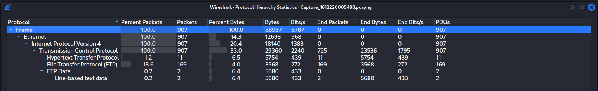](files/ProtocolHirerarchy.png)

#### Conversations and Endpoints :

From Conversations and Endpoints I can see all of the transmission are held between two interfaces here atatcker and the victim.

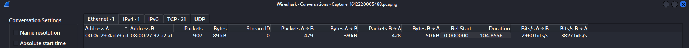](files/Conversations.png)

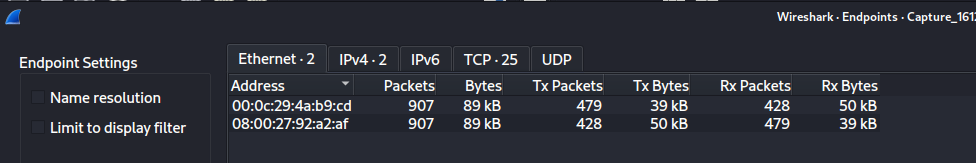](files/Endpoints.png)

Also there are much more interesting points that we might take note of .

### 1. It seems like our machine got hacked by an anonymous threat actor. However, we are lucky to have a .pcap file from the attack. Can you determine what happened? Download the .pcap file and use Wireshark to view it.

No answer needed for this ques. Just open the file in wireshark

### 2. The attacker is trying to log into a specific service. What service is this?

From the flow graph we can see the attacker (192.168.0.147) has sent multiple request to victim (192.168.0.115) on port 21.
Further if we analyze the packets then we can see the attacker was trying to scan the port 21 and then try to login FTP as username jenny.

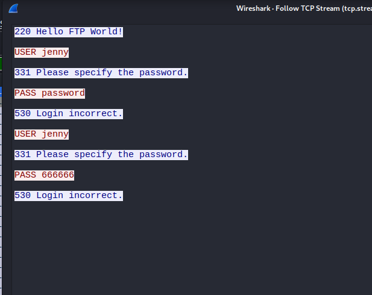](files/Answer2.png)

### 3. There is a very popular tool by Van Hauser which can be used to brute force a series of services. What is the name of this tool? 

Using google search I had found that hydra was developed by Van Hauser.

### 4. The attacker is trying to log on with a specific username. What is the username?

We have already found the answer in our question 2.


### 5. What is the user's password?

As we have seen before for incorrect result the error message was `login unsuccessfull`. So I have searched for string `login successfull` in the packets.
And at packet 309 we can found that we have got one `login successfull` message.

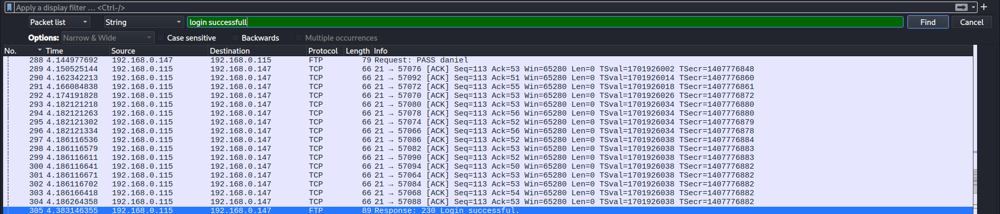](files/Answer5a.png)

Now if we open the packet or the stream we can find the password in clear text.

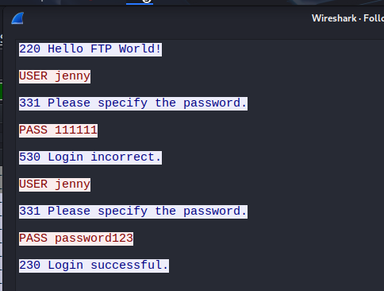](files/Answer5b.png)

### 6. What is the current FTP working directory after the attacker logged in?

Now from here if we follow the tcp stream we can find that the user has issued `pwd` command And the ftp server responsed with the current working directory. 

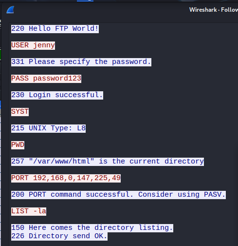](files/Answer6.png)

### 7. The attacker uploaded a backdoor. What is the backdoor's filename?

In the TCP stream the attackar has issued PORT command.The client sends the PORT command, specifying its IP address and a port number, to the server. The server then initiates a connection to that specified port on the client's machine. The command typically has the following format: PORT (h1,h2,h3,h4,p1,p2) where h1 through h4 represent the IP address (e.g., 192,168,1,100) and p1 and p2 represent the port number (calculated as (p1 * 256) + p2), according to Salesforce. PORT 192,168,1,100,20,21 would mean the server should connect to port 5141 (20 * 256 + 21) on IP address 192.168.1.100.

Then he used STOR command to store the file shell.*** in the server from local machine.

After storing the exploit attacker has changed the file permission to exedcutable.

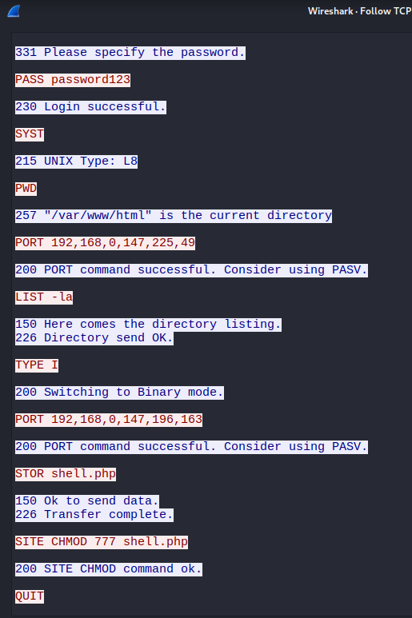](files/Answer7.png)

### 8. The backdoor can be downloaded from a specific URL, as it is located inside the uploaded file. What is the full URL?

At TCP stream 18 I have found the contents of the php revrse shell . It was developed by pentest monkey.

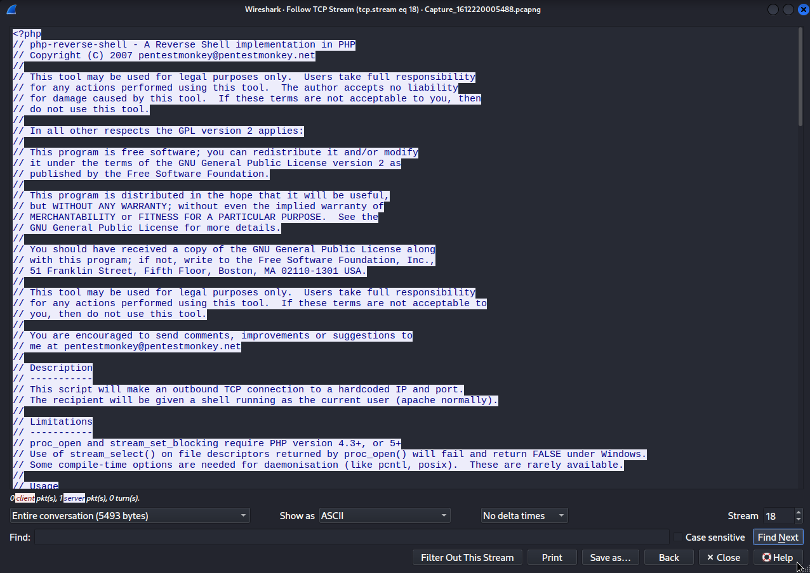](files/Answer8.png)

### 9. Which command did the attacker manually execute after getting a reverse shell?

After getting the rev shell the first command executed by the attacker was listed in TCP stream 20.

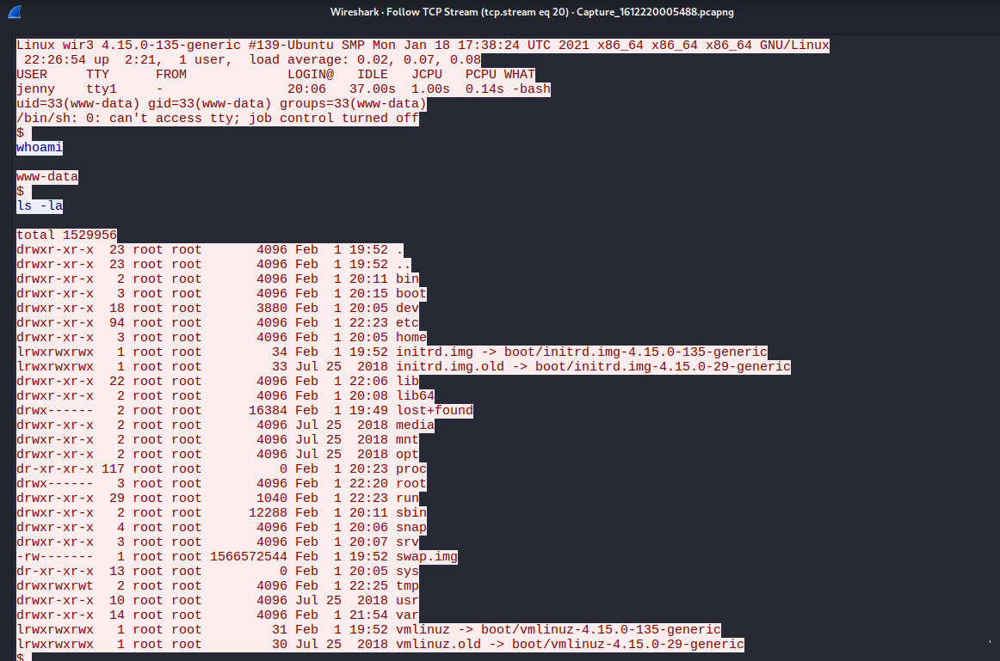](files/Answer9.png)

### 10. What is the computer's hostname?

After the attacker gains the shell then he has used python to convert it into an PTY shell. When he gains the python shell we can see the hostname of the victim machine.

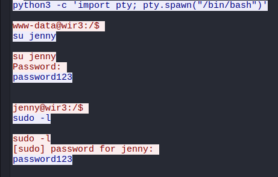](files/Answer10.png)

### 11. Which command did the attacker execute to spawn a new TTY shell?

The attacker has used python pty librery to spawn a new tty shell.

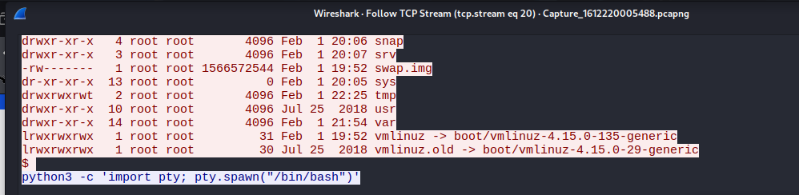](files/Answer11.png)

### 12. Which command was executed to gain a root shell?

The attacker has issued `sudo su` to upgrade the user from `jenny` to `root`.

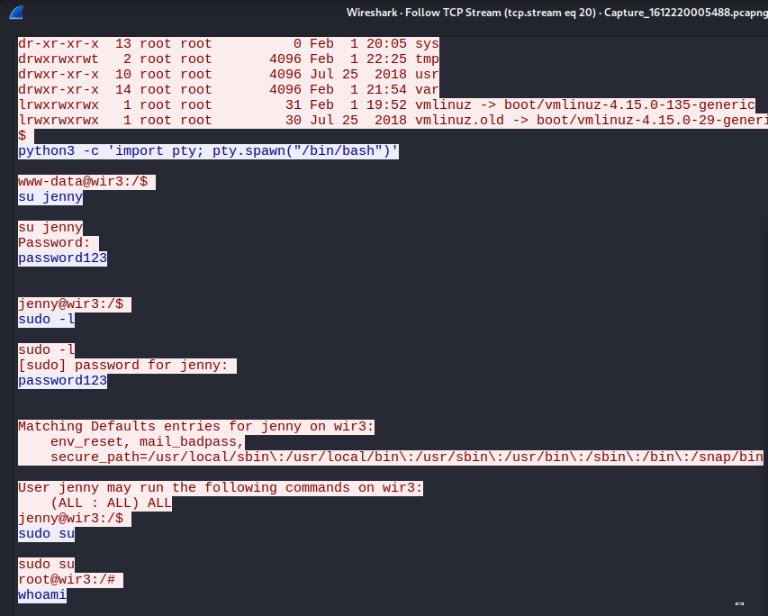](files/Answer12.png)

### 13. The attacker downloaded something from GitHub. What is the name of the GitHub project?

The attacker has downloaded Rep**.git 

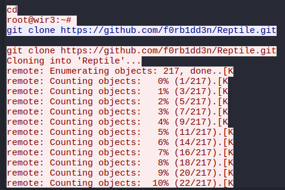](files/Answer13.png)

### 14. The project can be used to install a stealthy backdoor on the system. It can be very hard to detect. What is this type of backdoor called?

The repo is disabled So to investigate about the backdoor I have used waybackmachiene. After some navigation I have found that it was a `rootkit` type backdoor that gives root prev to user.

## Solution Part 2:

### This part is asking to replicate the attack.

#### 1. The attacker has changed the user's password! Can you replicate the attacker's steps and read the flag.txt? The flag is located in the /root/Reptile directory. Remember, you can always look back at the .pcap file if necessary. Good luck!

#### 2. Run Hydra (or any similar tool) on the FTP service. The attacker might not have chosen a complex password. You might get lucky if you use a common word list.

```hydra -l jenny -P /usr/share/wordlists/rockyou.txt ftp://<Target IP>```

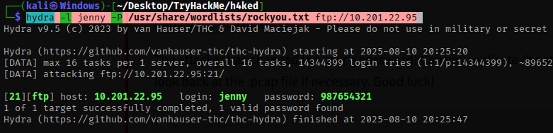](files/Answer22.png)

#### 3. Change the necessary values inside the web shell and upload it to the webserver

To solv rest of the exploitation Login in FTP. 

After successfully loggin in download the shell.php file and change the req parameters . Then use `put` command to store the shell.php to the `home` directory of `www-data` .

Exploit the target by visiting `http://<target-IP>/shell` , Don't forget to start the listener'

After getting the shell convert it to a `TTY` shell using python3.

Currently We are `www-data` using `su` command we can change user to `jenny`.

Now if we run `sudo -l` we can see user `jenny` can run all commands as root.

to change t root from jenny I have use `sudo su` 

#### 4. Create a listener on the designated port on your attacker machine. Execute the web shell by visiting the .php file on the targeted web server.

#### 5. Become root!

We are `root` user now.

#### 6. Read the flag.txt file inside the Reptile directory
The flag is in `/root/reptile` read the flag

python3 -c "import pty;pty.spawn('/bin/bash')"

