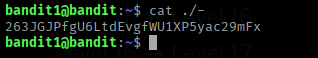
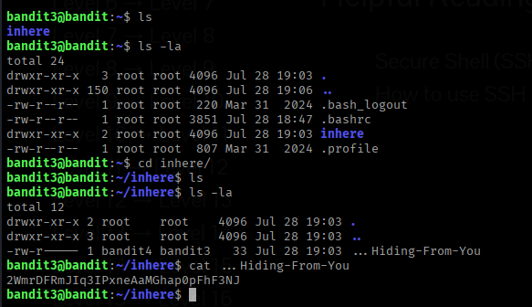
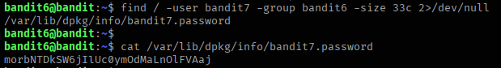

# Natas WarGame

## Bandit Description

The Bandit wargame is aimed at absolute beginners. It will teach the basics needed to be able to play other wargames. If you notice something essential is missing or have ideas for new levels, please let us know!

Note for beginners

This game, like most other games, is organised in levels. You start at Level 0 and try to “beat” or “finish” it. Finishing a level results in information on how to start the next level. The pages on this website for “Level <X>” contain information on how to start level X from the previous level. E.g. The page for Level 1 has information on how to gain access from Level 0 to Level 1. All levels in this game have a page on this website, and they are all linked to from the sidemenu on the left of this page.

You will encounter many situations in which you have no idea what you are supposed to do. Don’t panic! Don’t give up! The purpose of this game is for you to learn the basics. Part of learning the basics, is reading a lot of new information. If you’ve never used the command line before, a good first read is this introduction to user commands.

### There are several things you can try when you are unsure how to continue:

1. First, if you know a command, but don’t know how to use it, try the manual (man page) by entering man <command>. For example, man ls to learn about the “ls” command. The “man” command also has a manual, try it! When using man, press q to quit (you can also use / and n and N to search).

2. Second, if there is no man page, the command might be a shell built-in. In that case use the “help <X>” command. E.g. help cd

3. Also, your favorite search-engine is your friend. Learn how to use it! I recommend Google.

4. Lastly, if you are still stuck, you can join us via chat

You’re ready to start! Begin with Level 0, linked at the left of this page. Good luck!

Note for VMs: You may fail to connect to overthewire.org via SSH with a “broken pipe error” when the network adapter for the VM is configured to use NAT mode. Adding the setting IPQoS throughput to /etc/ssh/ssh_config should resolve the issue. If this does not solve your issue, the only option then is to change the adapter to Bridged mode.

## Level 0:
	
### Level Goal

The password for the next level is stored in a file called readme located in the home directory. Use this password to log into bandit1 using SSH. Whenever you find a password for a level, use SSH (on port 2220) to log into that level and continue the game.
			
Command:

`ssh bandit0@bandit.labs.overthewire.org -p 2220`

When Prompted provide the password as the password is also bandit0

](screenshots/Level0.png)`
		
Now we can Login as bandit1.


## Level 1:

### Level Goal

The password for the next level is stored in a file called - located in the home directory

Commands you may need to solve this level

`ls` , `cd` , `cat` , `file` , `du` , `find`

### Solution:

Here in the home directory we can find the folder named - . But if we try to read using `cat -` it gives error .

To read this type of files we can use `./` notation before the file name .

### command:

`cat ./-`

](screenshots/Level1.png)


## Level 2:

### Level Goal

The password for the next level is stored in a file called –spaces in this filename– located in the home directory

### Commands you may need to solve this level

`ls` , `cd` , `cat` , `file` , `du` , `find`

### Solution:
	
Here the file name has some spaces and - before starting the file name :

To read This type of file we can use `./` notation with `\` charcter that evaluates to escape character .

### command	

`cat ./--spaces\ in\ this\ filename--`

](screenshots/Level2.png)

## Level 3:

### Level Goal

The password for the next level is stored in a hidden file in the inhere directory.

Commands you may need to solve this level

`ls` , `cd` , `cat` , `file` , `du` , `find`

### Solution:

As the challange describes the flag is hidden. In linux to see the hidden files we use `la` switch.

In the users home directory one directory available. First navigating to the directory we try to list out the contens of the directory .

```
ls -la
total 12
drwxr-xr-x 2 root    root    4096 Jul 28 19:03 .
drwxr-xr-x 3 root    root    4096 Jul 28 19:03 ..
-rw-r----- 1 bandit4 bandit3   33 Jul 28 19:03 ...Hiding-From-You
```
We can see the file named `...Hiding-From-You`.

to read we can issue cat command 

`cat ...Hiding-From-You`

<!-- 2WmrDFRmJIq3IPxneAaMGhap0pFhF3NJ -->

](screenshots/Level3.png)

## Level 4:

### Level Goal

The password for the next level is stored in the only human-readable file in the inhere directory. Tip: if your terminal is messed up, try the “reset” command.

### Commands you may need to solve this level

`ls` , `cd` , `cat` , `file` , `du` , `find`

### Solution:

We can use here file command that list us the types of the files .

```file ./-*
./-file00: data
./-file01: data
./-file02: data
./-file03: data
./-file04: data
./-file05: data
./-file06: data
./-file07: ASCII text
./-file08: data
./-file09: data```

Here we can see only `-file07` has ASCII text data that is human readable.

Read and get flag.

<!-- 4oQYVPkxZOOEOO5pTW81FB8j8lxXGUQw -->

](screenshots/Level4.png)

## Level 5:

### Level Goal

The password for the next level is stored in a file somewhere under the inhere directory and has all of the following properties:

1. human-readable
2. 1033 bytes in size
3. not executable

Commands you may need to solve this level

`ls` , `cd` , `cat` , `file` , `du` , `find`

### Solution:

To find the file which is 1033 b in size and not executable we can use find command with `-size` and `!` switch

```find . -type f -size 1033c ! -executable
./inhere/maybehere07/.file2
```

Now read the file and get the flag
<!-- HWasnPhtq9AVKe0dmk45nxy20cvUa6EG -->

](screenshots/Level5.png)

## Level 6:

### Level Goal

The password for the next level is stored somewhere on the server and has all of the following properties:

1. owned by user bandit7
2. owned by group bandit6
3. 33 bytes in size

### Commands you may need to solve this level

`ls` , `cd`, `cat` , `file` , `du` , `find` , `grep`

### Solution:

This time the home directory of the user is empty. So we have to find the file in the full file system at onece. To do that we can find from the `/` directory , And we will redirect the errors to `/dev/null`

```
find / -user bandit7 -group bandit6 -size 33c 2>/dev/null
/var/lib/dpkg/info/bandit7.password
```

Now read the file and get the flag.

`cat cat /var/lib/dpkg/info/bandit7.password`

<!-- morbNTDkSW6jIlUc0ymOdMaLnOlFVAaj-->

](screenshots/Level6.png)

## Level 7:

### Level Goal

The password for the next level is stored in the file data.txt next to the word millionth.

### Commands you may need to solve this level

`man`, `grep`, `sort`, `uniq`, `strings`, `base64`, `tr`, `tar`, `gzip`, `bzip2`, `xxd`

### Solution:

The file contains long human readable text and the the pasword is next to the word milionth. To get the word we can use `grep`.

```
cat data.txt | grep "millionth"
millionth       dfwvzFQi4mU0wfNbFOe****skMLg7eEc
```
<!-- LeveldfwvzFQi4mU0wfNbFOe9RoWskMLg7eEc -->

](screenshots/Level7.png)

## Level 8:

### Level Goal

The password for the next level is stored in the file data.txt and is the only line of text that occurs only once

### Commands you may need to solve this level

`grep`, `sort`, `uniq`, `strings`, `base64`, `tr`, `tar`, `gzip`, `bzip2`, `xxd`

### Helpful Reading Material

Piping and Redirection

### Solution:
	
We can use `uniq` command with `c` switch . But `uniq` only works when two similer lines are adjacent ,
So we need to sort he files first.

```
sort data.txt | uniq -c 
     10 0KFjx0YNyiScs5m9bP7TALBQ1FnD0sBX
     10 206qRNE53VBTTvhS0CxxJzkv1RuAZGYu
     10 27Dt22kSXiiZyFL1yrwZR85RKGDGwcdH
     10 2gE83JhgGF2cXjV1ErugBYzGxe6stMMf
     10 2MNstSLPfXwoybkAp3ow0B0OHSq2QWUX
     10 2SPrkAR4oFkkPtWV3of0Z7rR7GkEArp5
     10 2t2sOTXDwEQeObR6WGAqXXDBBum2TR5d
     10 3bWHAOcHJggMxm5NgPkMpeA9GzFQG5vo
     10 3HT5LY4uSXQXsRRNK3uUW0enxPbarRYQ
     10 3mr60VTCYFuQFCgD2QRl2ojnF3nbcXdL
      1 4CKMh1JI91bUIZ******anal4xvAg0JM
     10 51T6T1zM6XPVhTlNzVfqpM94ed3dS39n
     10 52JmRMNVxV0iiAep6voOaBOyfFqG62PC
     10 5J6LfcYB30UUQsUTyjMC0xDq76F6Syry
     10 5Ts8Y3d8pVhxsMzXNrgDHHpeVT2tqmhD
```

We found the line that occurs only once in the text file.

<!-- 4CKMh1JI91bUIZZPXDqGanal4xvAg0JM -->

](screenshots/Level8.png)

## Level 9:

### Level Goal

The password for the next level is stored in the file data.txt in one of the few human-readable strings, preceded by several ‘=’ characters.

### Commands you may need to solve this level

`grep`, `sort`, `uniq`, `strings`, `base64`, `tr`, `tar`, `gzip`, `bzip2`, `xxd`

### Solution:

When We run `file` command it shows the file is raw data. To read the strings associated with the file We can run `strings` command.

```
 strings data.txt
 %H2j
Wr<h8w
^y=7

 <--SNIP-->
========== FGUW5ilLVJrxX9k****N4MgbpfMiqey
<--SNIP-->

L5@&h0
ZM9(Q
```

<!-- FGUW5ilLVJrxX9kMYMmlN4MgbpfMiqey -->

](screenshots/Level9.png)

## Level 10:

### Level Goal

The password for the next level is stored in the file data.txt, which contains base64 encoded data


### Commands you may need to solve this level

`grep`, `sort`, `uniq`, `strings`, `base64`, `tr`, `tar`, `gzip`, `bzip2`, `xxd`

### Helpful Reading Material

Base64 on Wikipedia

### Solution :

The end of the text ends with `'=='` this indicates the string might be base64 encoded. To decode the string and read we can use `base64` command.

```
cat data.txt | base64 -d
The password is dtR173fZKb0RRsD*****2RWnpNVj3qRr
```
<!-- dtR173fZKb0RRsDFSGsg2RWnpNVj3qRr -->

](screenshots/Level10.png)
